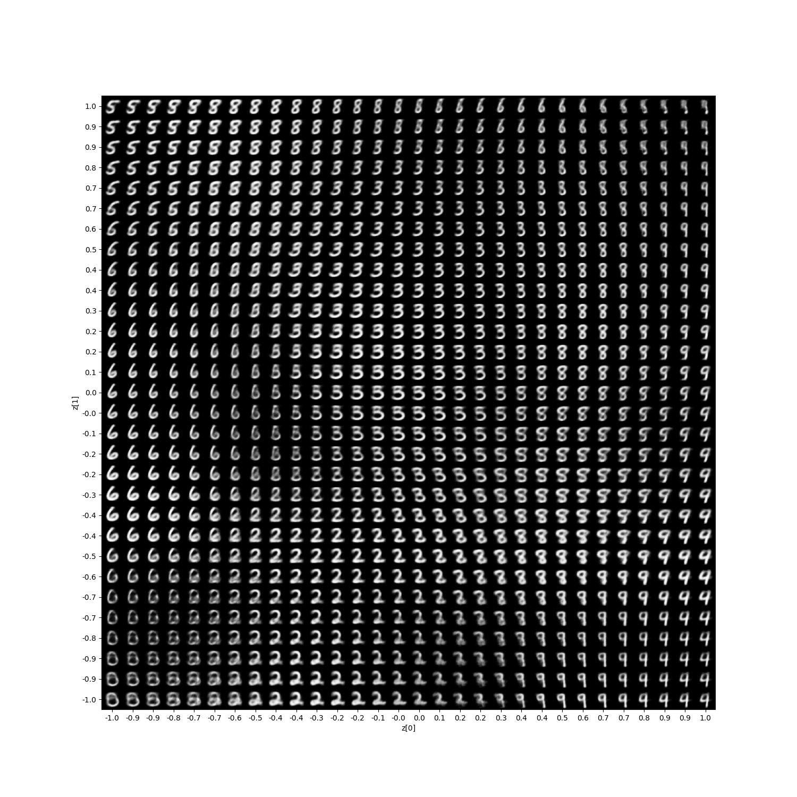
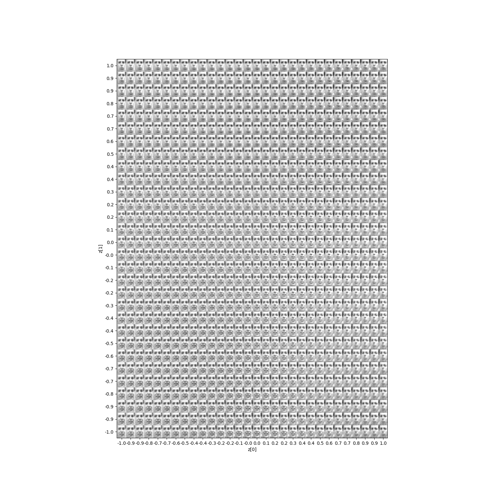
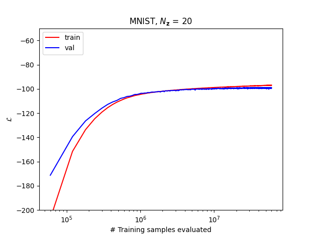
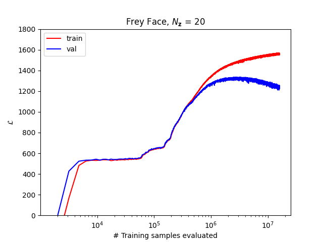

# DD2434-VAE-Project (Re-Autoencoding Variational Bayes)

Project in DD2434 Advanced Machine Learning to reproduce the paper title [Auto-Encoding Variational Bayes](https://arxiv.org/abs/1312.6114). See the reproduced results in the report (some are also located at  ```images/```). The project was done by:

- [Diogo Pinheiro](https://github.com/DiogorPinheiro)
- [Jakob Lindén](https://github.com/jakobGTO)
- [Patrick Jonsson](https://github.com/hiver-py)
- [Márk Antal Csizmadia](https://github.com/mark-antal-csizmadia)

## Installation and Usage

In the CLI of your choice

```bash
git clone https://github.com/jakobGTO/DD2434-VAE-Project.git
```

Create a virtual environment (or in your base environment) with Anaconda or any virtual environment manager (see Anaconda example below): 

```bash
conda create -n dd2434_vae_project python=3.8
source activate dd2434_vae_project
pip install -r requirements.txt
```

Use the ```config.yml``` configuration file to train a Variational Auto-Encoder (VAE), with desired encoder and decoder network parameters and decoder type (Bernoulli or Gaussian), training parameters (e.g.: learning rate) and the data set (MNIST or Frey face). Then run the main script ```VAE.py``` as follows:

```bash
cd DD2434-VAE-Project
python VAE.py
```


## Results

Some of the results are shown below.

The two-dimensional latent space in the case of the MNIST dataset:



The two-dimensional latent space in the case of the Frey face dataset:



The variational lower bound in the case of the MNIST dataset with a 20-dimensional latent space:



The variational lower bound in the case of the Frey face dataset with a 20-dimensional latent space:


